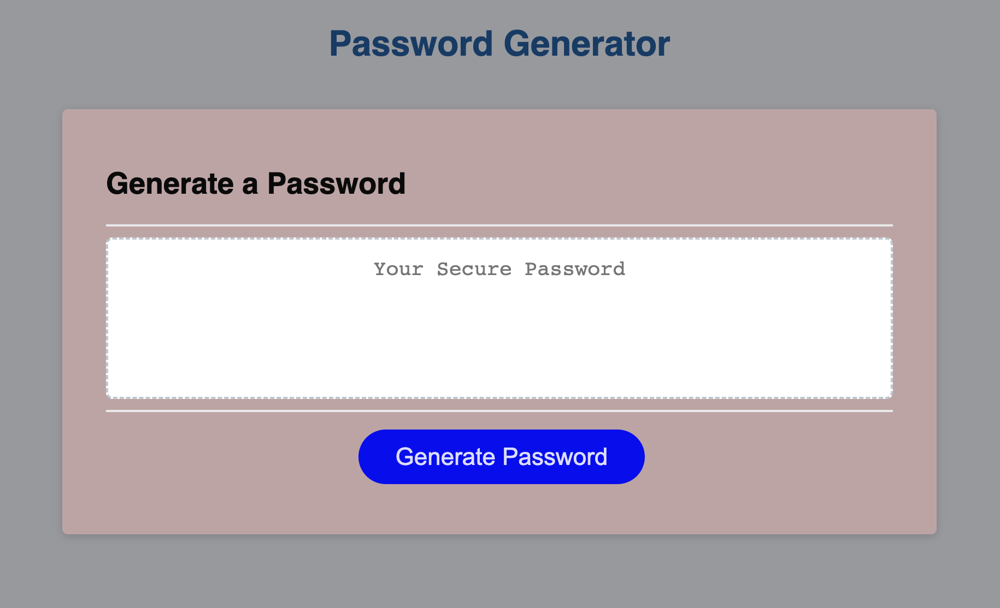

# README.md
# passGen
Random Password Generator

This was created for the purpose of fulfilling the challenge requirements in module 3. We were to take the starter code (HTML/CSS) and build out the javascript to make the page function to meet the below requirements.

# Description 
```
GIVEN I need a new, secure password
WHEN I click the button to generate a password
THEN I am presented with a series of prompts for password criteria
WHEN prompted for password criteria
THEN I select which criteria to include in the password
WHEN prompted for the length of the password
THEN I choose a length of at least 8 characters and no more than 128 characters
WHEN asked for character types to include in the password
THEN I confirm whether or not to include lowercase, uppercase, numeric, and/or special characters
WHEN I answer each prompt
THEN my input should be validated and at least one character type should be selected
WHEN all prompts are answered
THEN a password is generated that matches the selected criteria
WHEN the password is generated
THEN the password is written to the page
```
# Mock-up
The following image shows the webpage's apperance




# Links

## End project

https://kylekarotko.github.io/passGen/

## Github Repo

https://github.com/KyleKarotko/passGen
